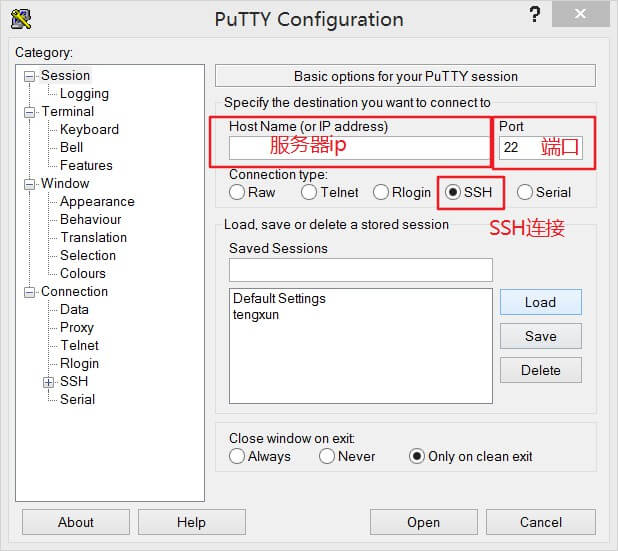
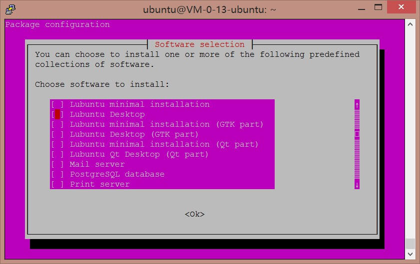
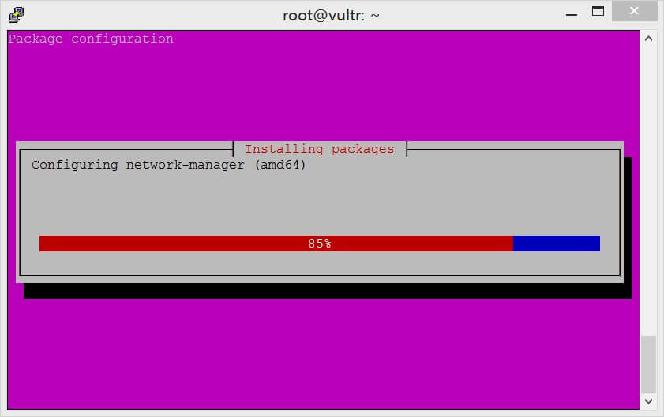
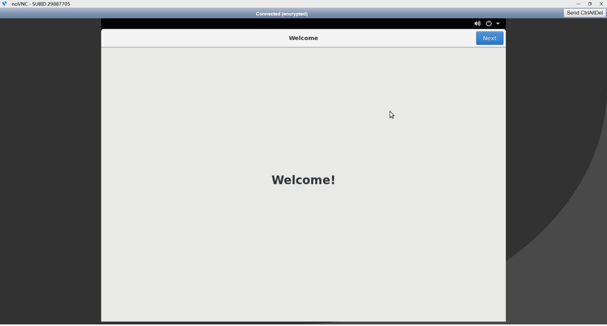
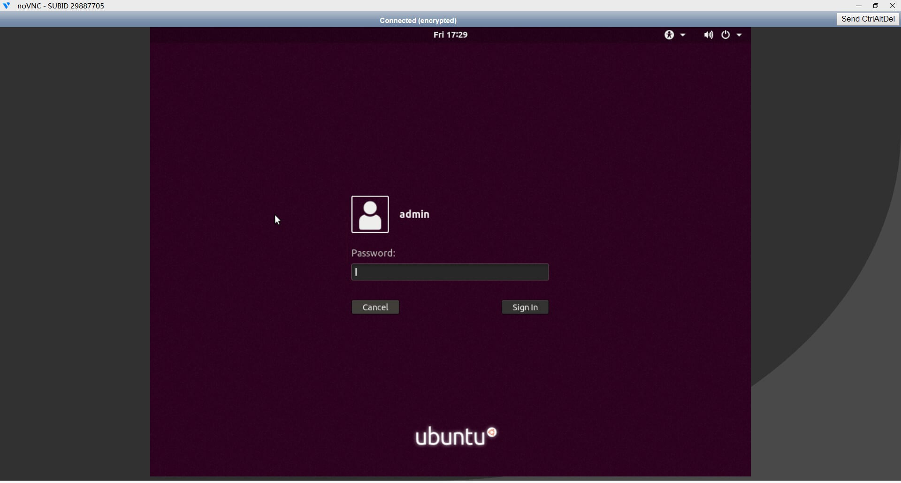
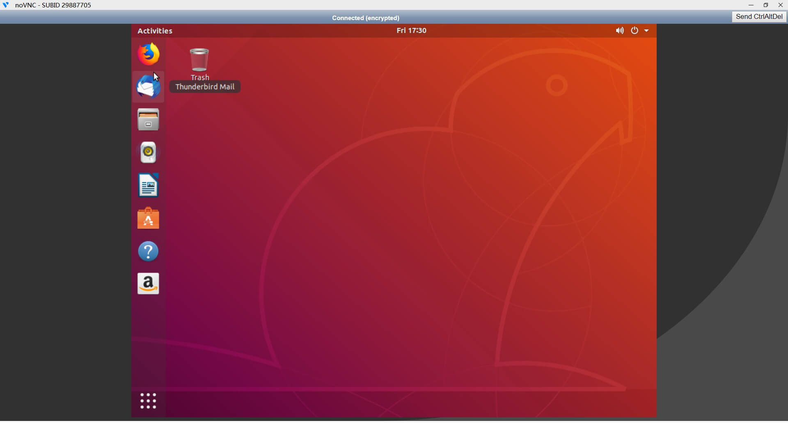
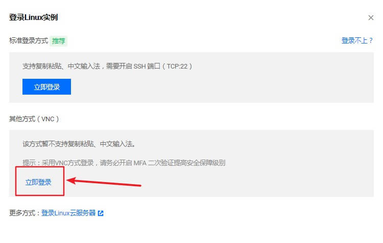
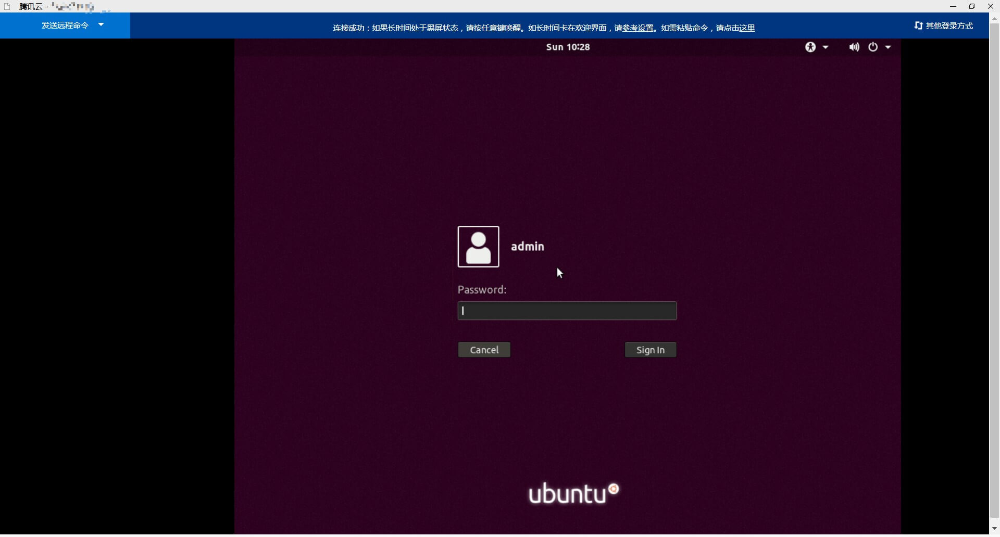
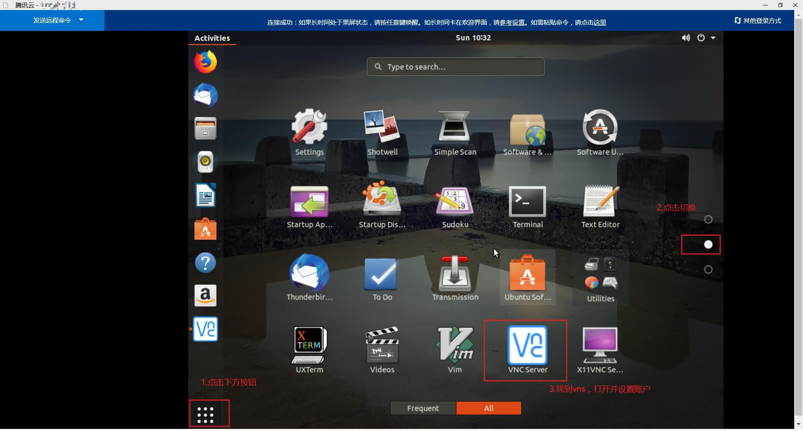

# ubuntu服务器终端及图形界面连接
ubuntu服务器版本: 18.04.01 LTS 64位  
电脑系统: windows8.1
2019.10.4

## 1.命令行连接
如果只是用linux终端命令行，使用PuTTY以SSH协议连接即可，简单易操作

安装PuTTY(我使用的是0.70版本)，打开后只需要填写ip地址，点击open即可



打开命令行界面后，输入用户名，密码(密码先复制好并在光标处右击即可)，连接成功

然后就可以愉快的使用命令行了

## 2.GUI连接
 ubuntu图形界面(Graphical User Interface, 简称GUI)连接

### 2.1 vultr ubuntu安装图形界面
putty连接命令行

在ubuntu服务器上安装桌面系统(GUI)
```js
sudo apt-get update // 更新软件列表
sudo apt-get upgrade -y // 更新软件
sudo apt-get install tasksel -y // 安装或升级tasksel
sudo tasksel // 进入选择图形界面，如下图
```



空格选中，按tab切换到ok，并回车



安装需要花一点时间

安装好后，重启服务器，在vultr服务器控制台直接登录，然后进行配置，然后就可以直接进入ubuntu的可视界面啦~，设置密码的时候要注意大小写哦







安装vns，vns是一个用于远程桌面控制的工具，vns需要注册并用于远程连接账户
```js
sudo apt-get update
sudo apt-get -f -y install // 后面意思是？
curl -O https://www.realvnc.com/download/file/vnc.files/VNC-Server-6.4.1-Linux-x64.deb
sudo dpkg -i VNC-Server-6.4.1-Linux-x64.deb
sudo systemctl start vncserver-virtuald.service 
sudo systemctl enable vncserver-virtuald.service
```
安装未成功，显示内存不够(不知道是哪里出了问题)，后面腾讯云安装成功，可以参照后面腾讯云图形界面安装vns

命令集合
```js
sudo apt-get update
sudo apt-get upgrade -y
sudo apt-get install tasksel -y
sudo tasksel

sudo apt-get update && apt-get -f -y install 
curl -O https://www.realvnc.com/download/file/vnc.files/VNC-Server-6.4.1-Linux-x64.deb
sudo dpkg -i VNC-Server-6.4.1-Linux-x64.deb
sudo systemctl start vncserver-x11-serviced && systemctl enable vncserver-x11-serviced
```
### 2.2 腾讯云服务器安装可视化界面

执行下面一系列命令(我也不懂||)，总之是为了能够使用腾讯云控制台的图形界面
```js
sudo apt-get install xinit
sudo apt-get install gdm  ( 登陆窗口，用于管理账户登陆的，还可以用来切换别的桌面环境。 )
sudo apt-get install ubuntu-desktop 
shutdown -r now (重启操作，不行服务器重启)

sudo apt-get install -y xauth xterm x11-common x11-xkb-utils xfonts-base xfonts-encodings xfonts-utils xserver-common // 安装必要的系统库
sudo apt-get install -y xvfb // 安装 Xvfb
sudo apt-get install -y x11vnc // 安装 x11vnc

x11vnc -rfbport 12345 -passwd CrekeNet -create -forever // 启动 VNC 远程桌面 启动 VNC 远程桌面命令如下，其中 12345 为端口号
```
这时我们再到腾讯云服务器控制台登陆服务器，并选择以vnc方式登陆，就可以进入可视化桌面了




如果卡在了代码页面或者锁屏界面，需要硬重启再次登录

然后就是如vultr一样设置好账户和密码即可

再使用putty登陆，输入以下命令(安装vns应用)
```js
sudo apt-get update
sudo apt-get upgrade -y
curl -O https://www.realvnc.com/download/file/vnc.files/VNC-Server-6.4.1-Linux-x64.deb
sudo dpkg -i VNC-Server-6.4.1-Linux-x64.deb
systemctl start vncserver-virtuald.service
systemctl enable vncserver-virtuald.service
```
然后打开图形界面，找到vns，进行配置，后面就可以在window的vns打开远程连接了





最后打开window系统的vnc软件进行连接就可以啦~


## 参考
- [Ubuntu 18.04服务器安装gnome图形化桌面并vnc远程登陆--vultr](https://www.bilibili.com/video/av62259882?from=search&seid=7530009430470344997)
- [腾讯云Ubuntu安装可视化桌面](https://www.cnblogs.com/tangge/p/10000275.html)