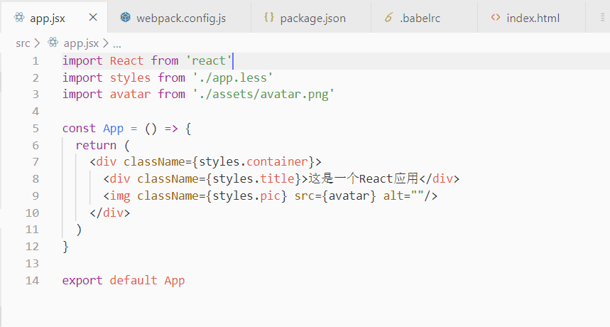
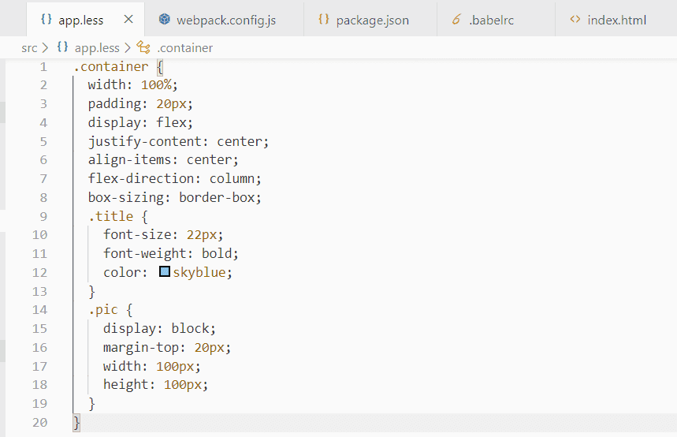
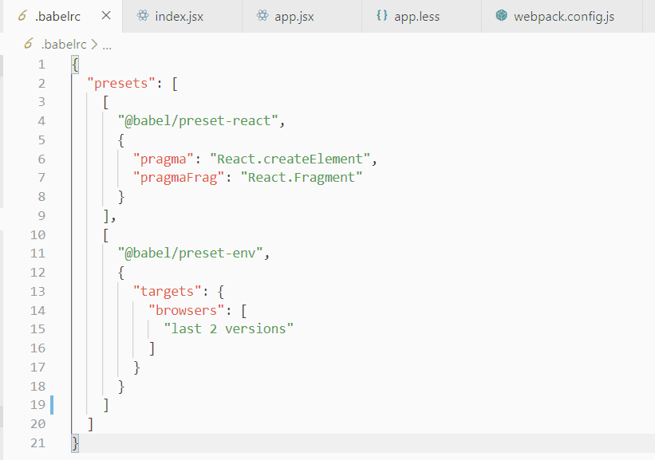
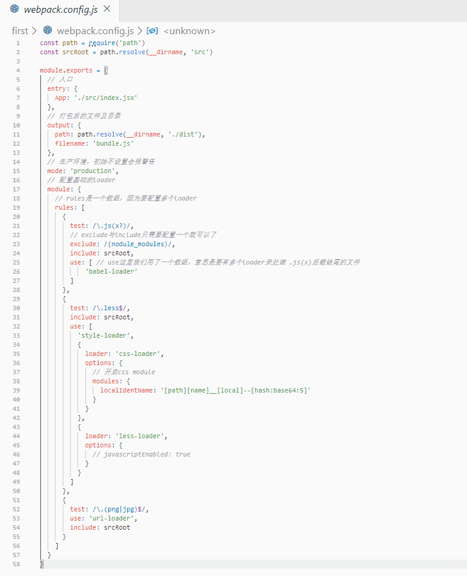
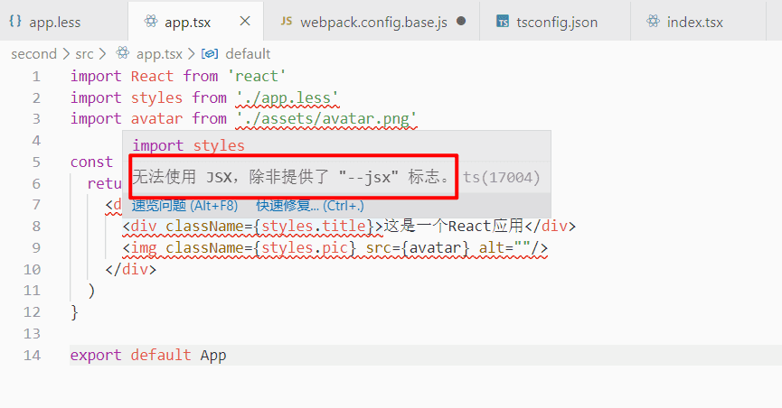
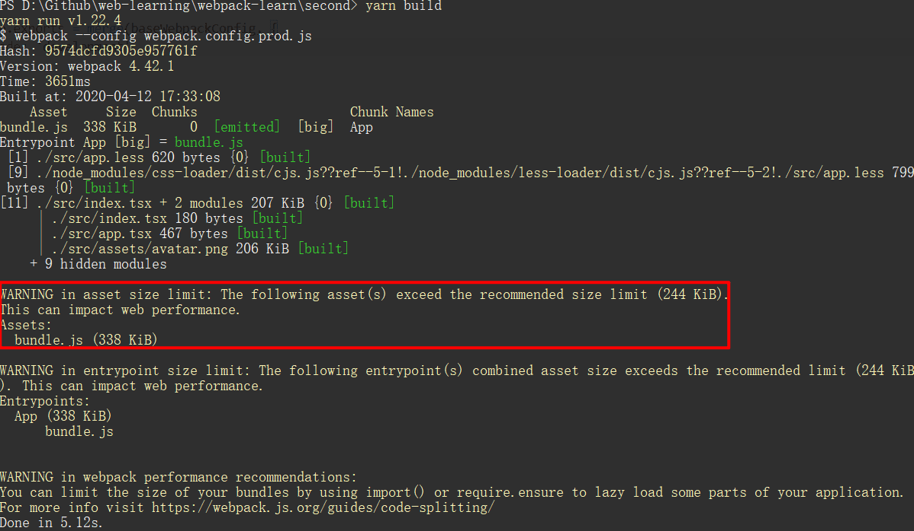

# 使用 webpack 从零配置开发环境

使用的 webpack 版本是@4.39.3，不过@5 beta 版已经发布了，emmmm...

## 1.实现对 JSX, JS, PNG, LESS 等文件进行打包

将 JSX, LESS 等文件进行打包成 bundle.js，在 HMTL 中引入并可以在浏览器访问

[源码地址](https://github.com/xblcity/web-learning/tree/master/webpack-learn/first)

### 1.1 初始化

- 新建 first 文件夹

- 在文件夹中使用`npm init -y`生成`package.json`文件

### 1.2 安装 webpack

使用`npm`或者`yarn`安装下面依赖，本文全部使用的`yarn`

```js
yarn add webpack webpack-cli -D
```

> 注释: webpack-cli 是 webpack 的命令行工具 -D 是 --save--dev 的缩写， -S 是 --save 的缩写。版本号：webpack@4.39.3，webpack-cli@3.3.7

### 1.3 安装样式相关 loader

```js
yarn add css-loader style-loader less less-loader -D
```

> 注释: css-loader 可以配置 css-module

### 1.4 安装 babel,react 相关 loader，安装 react 相关依赖

安装 babel

```js
yarn add babel-loader @babel/core @babel/preset-env -D
```

> 注释: babel，将 es6 转换为 es5，@babel/core 是 babel-core 的第七版，@babel/preset-env 是 babel-preset-env 升级版，用于配置浏览器的兼容度以及使用最新 ES6 语法。不需要安装 babel-preset-stage-0，因为 preset-env 已经集成了这几个 stage 的功能。但是 preset-env 不支持修饰器，动态引入，静态属性等等 ES6 最新的语法

安装 babel-react

```js
yarn add @babel/preset-react -D
```

> 注释: @babel/preset-react 是 babel-preset-react 升级版, 用于将 jsx 转换成 js

安装 react 相关依赖

```js
yarn add react react-dom -S
```

> 注释, babel 转换主要使用到的是 react.createElement()方法

### 1.5 安装图片处理相关 loader

```js
yarn add url-loader file-loader -D
```

### 1.6 项目目录结构

新建配置文件及开发文件

```js
-- dist // 用于存放打包后的文件
-- node_modules // 依赖包，自动生成
-- webpack.config.js // webpack配置
-- .babelrc // babel配置
-- src
  -- assets
    -- avatar.png
  -- index.jsx
  -- app.jsx
  -- app.less
  -- index.html
-- package.json
-- .gitignore // 设置git忽略文件
```

可以按照这个顺序对文件进行配置与修改 `src/app.js` 以及 `src/app.less` ---> `src/index.jsx` ---> `webpack.config.js` ---> `.babelrc`

贴一下主要文件的内容










关于 webpack 的一些配置，可以参考[上一篇的内容](https://github.com/xblcity/blog/blob/master/fe-engineering/webpack.md)

### 1.7 踩坑点

- webpack 配置文件需要使用 Common.js 模块规范(因为是 node 可执行文件)，ES6 模块语法无法使用，但是其他文件如 app.js 可以使用 ES6 语法(因为有 babel-loader 可以进行转换)
- `index.tsx`，`ReactDOM.render(element, document.getElementById('app'))`要与`HTML`的节点`id`对应，其次,引入的`import ReactDOM from 'react-dom'`名字是不做严格区分的
- 构建完成的 script 文件要放在 id 为 app 的 div 下面

#### webpack 配置文件容易出错的部分

- webpack 容易写错的部分，output 的是 filename 以及 path，不是 pathname
- webpack module rules 里面书写的是 loader 的规则
- 注意：rules 之下的规则，test 后面跟正则表达式，而不是加引号的字符串
- 添加 mode，让 webpack 打包时进行相应的优化

#### 与 react 配置有关的注意事项

- 如果使用了 babel-loader 处理包含 jsx 语法的 js 文件，最好配置.babelrc(rc 可以解为 resource 缩写)里面的 presets 配置项，preset-react，preset-env 可以配置要兼容浏览器支持语法的程度。当然，.babelrc 也可以配置 plugins 选项，这里并没有用到

### 1.8 进行打包

在`package.json`文件的`script`中添加 `"build": "webpack --config webpack.config.js"`这行代码即可，不明白的可以直接去看源码

命令行输入`yarn build`，可以看到在`build`目录多出了一个`bundle.js`文件，把`src`目录下的`index.html`在浏览器中打开，就可以看到我们实现的页面了


## 2. 配置 ts 以及 dev 环境

### 2.1 配置 ts 开发环境

在此之前，我们先配置一下 ts-react 开发环境。

新建目录 second，全局安装`typescript`，目的是为了能够使用`tsc`命令

分别执行以下命令

```js
npm init -y // 生成package.json
tsc --init // 生成tsconfig.json
```

按照上一节的内容安装依赖

```js
yarn add webpack webpack-cli css-loader style-loader less less-loader babel-loader @babel/core @babel/preset-env @babel/preset-react url-loader file-loader -D

yarn add react react-dom -S
```

安装项目需要的 typescript 相关依赖

```js
yarn add typescript -D
yarn add @types/react-dom @types/react -D
```

> 注释：types 依赖包含.d.ts 声明文件，在 react 中用 TS 语法时，会自动对变量进行类型检测

```js
yarn add @babel/preset-typescript
```

因为要区分开发环境与正式环境的 webpack 配置，这里我们新建`base dev prod`对 webpack 进行配置

文件目录

```js
-- dist // 用于存放打包后的文件
-- node_modules // 依赖包，自动生成
-- webpack.config.base.js // webpack基础配置
-- webpack.config.dev.js // webpack开发环境配置
-- webpack.config.prod.js // webpack正式环境配置
-- .babelrc // babel配置
-- src
  -- assets
    -- avatar.png
  -- index.tsx
  -- app.tsx
  -- app.less
  -- index.html
-- package.json
-- tsconfig.json
-- .gitignore // 设置git忽略文件
```

当我们按照上一节的内容把`index.tsx app.tsx app.less`几个文件写好后，发现多处报红，我们需要把`tsconfig.json`文件的`jsx`选项的值改成`react`并取消注释。



关于 JSX 部分的代码不报红了，但是引入的 less 文件，png 文件报红了，为什么呢？是因为 TS 没有找到这两个文件对应的`.d.ts`声明文件，那应该如何解决？


可以自己写一个`.d.ts`文件对 png 以及 less 文件进行 intrface 定义，或者是安装依赖包进行自动生成，这里举例第一种方法

src 目录下新建`globalType.d.ts`

```js
declare module '*.less' {
  const content: any
  export = content
}

declare module '*.png' {
  const content: any
  export = content
}
```

这时候就没有红色警告啦~

但是还有一个问题，在`index.tsx`中，引入的`app.tsx`报红，但是把`.tsx`去掉`webpack`会找不到`app`文件而打包失败，这时候我们需要配置`webpack`的`resolve`配置项


```js
resolve: {
  // 省略文件后缀，让webpack自动查找
  extensions: ['.js', '.jsx', '.ts', '.tsx']
},
```

好了，页面终于没警告了~

紧接着配置`.babelrc`，其实主要就是多添加一个`@babel/preset-typescript` 的 `presets`

配置 webpack，安装依赖

```js
yarn add webpack-merge -D // 该依赖可以合并webpack配置
```

紧接着配置`webpack.config.base.js`以及`webpack.config.dev.js`，详细见源码

最后在`package.json`文件添加`build`命令`"build": "webpack --config webpack.config.prod.js"`并执行



显示打包文件过大，因为`less png`等文件也被打包成 js 文件了，这里暂时先放着，后面会进行优化

在`index.html`中引入`bundle.js`,在浏览器打开，发现加载成功

### 2.2 配置 dev 环境

如果每次改变一个文件，都要输入打包命令再去浏览器里面查看应用，开发会变得很麻烦，在开发环境下，我们可以使用基于 express 的 webpack 提供 webpack-dev-server，帮助我们更好的在开发环境中开发。

在此之前，我们需要安装两个插件，做到动态生成 bundle 以及 index.html 文件

```js
yarn add html-webpack-plugin clean-webpack-plugin -D // 每次生成新的html以及清理html
yarn add webpack-dev-server -D // devServer服务
```

把`src/index.html` `<script src="../dist/bundle.js"></script>`这行代码删除掉，因为配置了`html-webpack-plugin`会自动引入打包后的包

配置`webpack.config.base.js`文件，使得生成的包每次生成的名字都不一样，防止浏览器缓存

```js
// ...
const HtmlWebpackPlugin = require('html-webpack-plugin')
const { CleanWebpackPlugin } = require('clean-webpack-plugin')

module.exports = {
  // 入口
  entry: {
    App: './src/index.tsx'
  },
  // 打包后的动态文件及目录
  output: {
    path: path.resolve(__dirname, './dist'),
    filename: '[chunkhash:4][name]bundle.js'
  },
  // ...
  plugins: [
    new HtmlWebpackPlugin({
      template: './src/index.html',
      filename: 'index.html' //打包后的文件名
    }),
    new CleanWebpackPlugin()
  ]
}
```

```js
//webpack.config.dev.js
const merge = require('webpack-merge')
const baseWebpackConfig = require('./webpack.config.base.js')

module.exports = merge(baseWebpackConfig, {
  mode: 'development',
  devServer: {
    contentBase: './src', // 告诉devServer监听哪些文件的变化
    port: '3000', //默认是8080
    quiet: false, //默认不启用
    inline: true, //默认开启 inline 模式，如果设置为false,开启 iframe 模式
    stats: 'errors-only', //终端仅打印 error
    compress: true //是否启用 gzip 压缩
  }
})
```

在`package.json`文件添加`dev`命令`"dev": "webpack-dev-server --open --config webpack.config.dev.js"`并运行(--open 的意思是自动打开浏览器)

浏览器自动打开`http://localhost:3000`即项目 html，当我们修改`app.tsx`文件时，浏览器会自动刷新。

在 dev 模式下，我们在`dist`目录下是看不到任何文件的，因为 dev 把这些文件存放在内存中了

## 3.优化

loader 用于帮我们处理不同类型的文件，plugins 用于在打包过程中做优化

在使用它们的时候，我们可以思考一下为什么出现了这些 loader 以及 plugin，它们解决了前端的哪些问题

按照上面两个部分再进行操作一遍，加深记忆

```js
npm init -y

tsc --init

yarn add 
```

### 对 CSS 样式兼容 postcss

## 参考

- [webpack 文档指南](https://www.webpackjs.com/guides/)
- [深入浅出 Webpack](https://webpack.wuhaolin.cn/)
- [从零搭建项目](https://www.jianshu.com/p/dd9037db20f5)
- [深度解锁 Webpack 系列](https://juejin.im/post/5e5c65fc6fb9a07cd00d8838)
