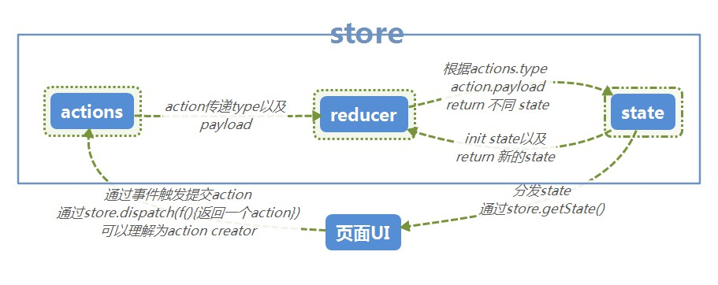

# Redux/React-Redux

## 概念和组成

- redux 包含 `store, state, reducer, action, action creator`这些概念

其中`store`可以理解为`redux`整体部分，下面包含了`reducer, state, action`这几部分，`action creator`是用来创建`action`的



### 初始化 store

`redux`初始化, 即创建`store`, 调用`createStore`方法创建一个`store`

```js
import { createStore } from 'redux'
// createStore方法，接收的第一个参数是一个函数
// 传入参数函数是reducer
const store = createStore(reducer)
// store对象提供了三个方法
store.getState()
store.dispatch()
store.subscribe()
```

### 创建 reducer

`reducer`是个函数,接收两个参数，一个是初始`state`,一个是`action`

`reducer`函数`return`出一个新的`state`，传递给`store`用于改变`state`

`reducer`是一个无副作用的纯函数

```js
function reducer(state = 0, action) {
  switch (action.type) {
    case 'INCREMENT':
      return state + 1
    case 'DECREMENT':
      return state - 1
    default:
      return state
  }
}
```

为什么叫 reducer，因为 reducer 可以作为 数组的 reduce()方法 的第一个参数

reduce 接收两个参数，第一个是个回调函数，第二个是初始值

其中回调函数接收四个参数，`accumulator`(上次计算出的值/累加值), `currentValue`(当前传递的值/item),`index`(下标，可选)，`array`(原数组，可选)

在下面这个例子中，`accumulator`是`state`，`currentValue`是`action`

```js
function reducer(state = 0, action) {
  switch (action.type) {
    case 'ADD':
      return state + action.payload // 执行一次，并返回accumulator
    default:
      return state
  }
}
const actions = [
  { type: 'ADD', payload: 1 },
  { type: 'ADD', payload: 2 },
]

actions.reduce(reducer, 0) // 输出3
```

### action && store.dispatch()

reducer 里面定义了初始 state 和改变 state 的接口，我们只需要传入对应的 action 即可,如上面 reducer 所示

一个 reducer 需要传递 state 以及 action，把这两个部分分解开来

用户在 view 层如何把 action 传给 reducer,就要用到 store 提供的 dispatch 方法了

```js
// dispatch接收一个对象参数，也就是action，action必须要有type属性
// action是一个对象，其中必须要包含type属性，其他属性可以随意定义，只要在reducer有对应处理即可
const action = {
  type: 'INCREMENT',
}
store.dispatch(action)
```

现在我们要想 reducer 根据我们传递的 action 参数里面的值进行相应改变，如下  
组件

```js
// 传入的action
store.dispatch({
  type: 'INCREMENT',
  payload: {
    // 这里不一定是payload，只要和reducer约定好即可,payload也不一定要是对象
    number: 3,
  },
})
```

store.js

```js
import { createStore } from 'redux'

function reducer(state = 0, action) {
  switch (action.type) {
    case 'INCREMENT':
      return state + action.payload.number
    default:
      return state
  }
}

const store = createStore(reducer)
```

这样 state 可以依据 action 的 type 以及 payload 参数，进行相应变化

### action creator

如果每次用户都在 view 层写这些`store.dispatch({})`,一方面，我们不知道用户到底 dispatch 哪些 action,另一方面，action 写起来比较繁琐，并且还有可能在多处调用相同的 dispatch 行为
所以我们可以定义 action creator,即一个个函数，这些函数会返回 action

```js
// 可以直接在reducer所在的文件进行定义
function increment(number) {
  return {
    type: 'INCREMENT',
    payload: { number },
  }
}
// 以下是在view调用
import store from './store'
import { increment } from './actionCreator'
// increment函数方法传入一个number参数
store.dispatch(increment(3))
```

action creator 和 action 都可以通过`store.dispatch()`直接调用，只不过 action creator 封装了一个可以返回 action 的函数

### store.getState()

在 view 也就是用户页面如何获取 store 里面的 state，需要用到上面 store 提供的 getState 方法

```js
import store from './store.js' // 这里为了方便，默认redux.js有暴露出的store对象
// getState方法不需要传参数
console.log(store.getState()) // 这里打印了 redux 的 state值
```

### 纯函数 reducer

reducer 函数的一个重要特征是，它是一个纯函数，也就是说，相同的输入，会得到相同的输出
和中学学的函数，如`y=2x`很相似，相同输入必有一样输出
在 reducer 里面不能直接重新给 state 赋值，而是返回一个新的 state，由 store 自己对 state 进行改变

```js
function reducer(state, action) {
  return { ...state, ...newState } // newState如果包含state里面的一部分值，会覆盖，否则，会新建
  // 或者
  return Object.assign({}, state, { ...newState })
  // 也可以使用 JSON.parse(JSON.string(xxx)) 进行简单的深拷贝
}
// 如果state是一个数组
function reducer(state, action) {
  return [...state, newItem]
}
```

### store.subscribe()

`store.subscribe()`方法, 接收一个回调函数，在回调函数里我们做相应的处理
当 redux 的 state 改变时，会自动触发`store.subscribe()`方法
我们可以在 subscribe 方法处理我们的需求

```js
let listenSubscribe = store.subscribe(() => {
  console.log('state发生了变化！')
  console.log('当前state', store.getState())
})
```

<!-- ### createStore 的简单实现

```js
const createStore = (reducer) => {
  // 对reducer进行判断处理等等。。
  // 假设已经 处理好了 state
  let state
  let listeners = []

  const getState = () => state

  const dispatch = (action) => {
    state = reducer(state, action)
    listeners.forEach()
  }

  const subscribe = (listener) => {}
}
``` -->

### reducer 的拆分

reducer 函数负责生成 state,由于整个应用只有一个 state 对象，包含所有数据，对于大型应用来说，这个 state 会很庞大，导致 reducer 函数也很庞大  
这时候我们需要将 reducer 拆分成多个，对于不同页面或者不同功能，我们把它拆分成独立的部分
通过 redux 提供的 combineReducers 方法

```js
import { createStore, combineReducers } from 'redux'
import { aReducer } from './aReducer.js'
import { bReducer } from './bReducer.js'

const totalReducer = combineReducers({
  aReducer,
  bReducer,
})

const store = createStore(totalReducer)
export default store
```

## 不使用 react-redux 缺点

- 对于有状态的组件，分发 state 需要使用 store.getState api
- 当需要更新 redux 的状态时，需要使用 store.subscribe 监听
- 页面需要同步更新时，redux 里面的数据需要获取到并保存到组件自身 state 里面
- 使用 redux 数据的组件必须要改成由状态组件

## 不使用中间件处理异步请求, 如 redux-thunk 或 redux-saga

在 view 层的某个函数内部(如在组件刚挂载时)处理异步请求，处理完异步请求并获取到结果之后再 dispatch 一个 action  
缺点是，

- 请求分散在很多 view 组件中，维护起来很麻烦
- 如果有多个组件调用了这个请求，每个组件的 mapDispatchToProps 都需要写(如果使用了 react-redux 的话)，
- 小型项目可以像这样使用

## 使用 react-redux

第三方库 react-redux,该库提供了 Provider 和 connect  
Provider 是一个普通的组件，可以作为顶层 app 状态的分发点,它只需要 store 属性就可以了，它会将 state 分发给所有被`connect`的组件  
connect 是一个柯里化函数，先接收两个函数参数，mapStateToProps 和 mapDispatchToProps,再接收一个参数(将要绑定的组件本身)  
mapStateToProps  
mapDispatchToProps 参数是一个回调函数，参数是 dispatch,

### react-redux 分发状态与改变状态

> 思考：为什么使用 react-redux  
> 这里参考官方文档：[文档](https://react-redux.js.org/introduction/why-use-react-redux)

- react-redux 是一个把 react 和 redux 绑定的库,redux 官方开发
- 使用 redux 的组件必须要成为有状态组件，而使用了 react-redux 则可以成为无状态组件，state 通过 connect 进行分发，组件更容易复用
- react-redux 内部进行了优化，可以避免不必要的 re-render

### 核心部分

- Provider: 从外部封装了整个应用，并向 connect 模块传递 store
- connect: 1.包装原组件，将 state 和 action 通过 props 的方式传到原组件内部 2.监听 store tree 的变化，使其包装的原组件可以响应 state 变化

### 不使用/使用 react-redux 分发 state 与提交 action 的方式区别

- 状态分发：前者使用 store.getState(), 后者通过 connect 传递的第一个回调函数拿到
- action 提交：前者通过 store.dispatch(action), 后者通过 connect 传递的第二个回调里面写 dispatch(action)

## 例子

TodoList.js ===== connect 部分

```js
import { connect } from 'react-redux'

const TodoList = (props) => (
  <div>
    <div>
      <input placeholder={props.inputValue} onChange={props.inputChange} />
      <button onClick={props.clickButton}>提交</button>
    </div>
    <ul>
      {props.list.map((item, index) => {
        return <li key={index}>{item}</li>
      })}
    </ul>
  </div>
)

// store向下分发状态(state)
const stateToProps = (state) => {
  return {
    inputValue: state.inputValue,
    list: state.list,
  }
}

// 向reducer提交action
const dispatchToProps = (dispatch) => {
  return {
    inputChange(e) {
      let action = {
        type: 'change_input',
        value: e.target.value,
      }
      dispatch(action)
    },
    clickButton() {
      let action = { type: 'add_item' }
      dispatch(action)
    },
  }
}

export default connect(stateToProps, dispatchToProps)(TodoList)
```

App.js ==== Provide 部分

```js
import React, { Component } from 'react'
import { Provider } from 'react-redux'
import TodoList from './TodoList'
import store from '../Store'

class App extends Component {
  render() {
    return (
      <Provider store={store}>
        <TodoList />
      </Provider>
    )
  }
}

export default App
```

### 参考

- [理解 React，但不理解 Redux，该如何通俗易懂的理解 Redux？](https://www.zhihu.com/question/41312576?sort=created)
- [Redux 入门教程（一）：基本用法](http://www.ruanyifeng.com/blog/2016/09/redux_tutorial_part_one_basic_usages.html)
