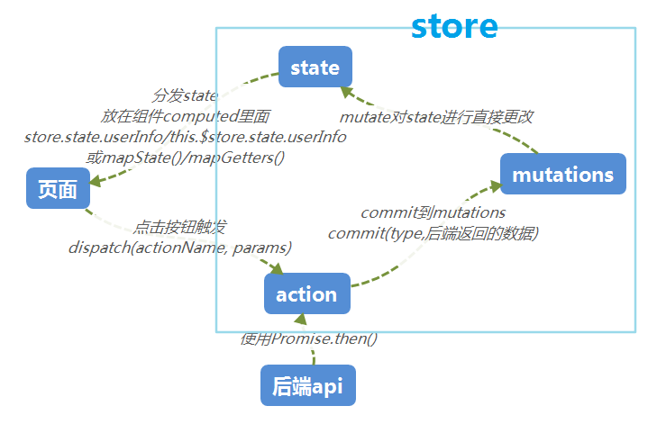
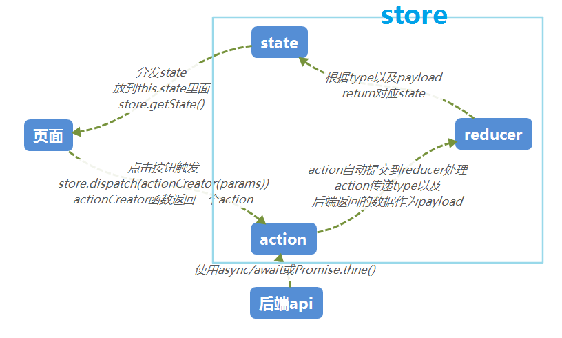

# vue-element-admin的使用

4.2.1版本

## 项目的目录

```js
├── src/
|   ├── api         // 用户请求的api都放在这个目录下
|   ├── assets      // 项目中使用的图片等静态资源
|   ├── components 
|   ├── directive 
|   ├── filters 
|   ├── icons       // svg图标
|   ├── components 
|   ├── layout 
|   ├── router      // 路由
|   ├── store       // vuex
|   ├── styles
|   ├── utils
|   ├── views       // 页面文件
|   ├── App.vue     // 入口页面
|   ├── main.js     // 入口初始化
|   ├── permission.js  // 权限管理
|   └── settings.js
├── build/
├── mock/
├── public/         // html模板
├── tests/
├── .env.development
├── .env.production
└── vue.config.js
```

## 初始化

因为后台接口已经写好了，所以需要取消mock，并更改api地址。这里使用的是`vue-admin-template`，在其基础上进行更改

`vue.config.js`注释webpack的devServer配置项的`before`项

`.env.development`修改api请求地址

发现启动项目的时候会打开两次浏览器，将webpack配置项devServer的`open:true`改为`false`，并在`package.json`文件的dev命令后面加上`--open`。

约定：views-api-router 路由-文件-api一一对应
vuex：只用来存储全局的信息，比如token，用户信息等
eslint: vscode插件开启保存时自动修复，不过代码格式化的问题还是需要prettier帮忙。同时安装vetur

## 登录及权限管理

登录从后端拿到token后，存放在cookie中，当然也可以放在localstorage中。然后在axios拦截器中配置请求头。

登录的地方用到的是vuex，这里把使用vuex的过程记录一下，对比redux





可以看出，vuex与redux相似度很高。除了一些api的不同，还有两点要注意：

1. redux中action会自动提交给reducer进行处理，而在vuex中action需要手动进行commit到mutations

2. redux reducer处理action时，不直接改变state，而是返回一个新的state。而vuex的mutations是直接对state数据进行修改

## 表单与表格查询

做后台系统最主要的部分就是数据的提交与展示，表单与表格是必不可少的部分。

一个复杂的表格页面应该有参数查询，表格导出等功能。

而一个表单应该有**新建、查看、编辑**的功能。这三种功能应该是同一个页面，根据不同的prop展示不同状态。


## 参考

- [手摸手，带你用vue撸后台 系列](https://juejin.im/post/59097cd7a22b9d0065fb61d2)


